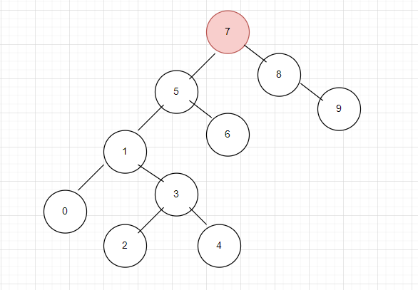

# Binary-Search-Tree-Projesi
patika.dev eğitimi kapsamında yaptığım Binary Search Tree Projesi'dir.

[Patika](https://app.patika.dev/)
[Patika Profilim](https://app.patika.dev/aytac)

1. [7, 5, 1, 8, 3, 6, 0, 9, 4, 2] dizisinin Binary-Search-Tree aşamalarını yazınız. Örnek: root x'dir. root'un sağından y bulunur. Solunda z bulunur vb.

7'yi root olarak kabul edersek:

1. 5, 7'den küçüktür. 5'i 7'nin soluna alıyoruz.  
2. 1, 7'den küçüktür. 1, 5'ten küçüktür. 1'i 5'in soluna alıyoruz. 
3. 8, 7'ten büyüktür. 8'i 7'nin sağına alıyoruz. 
4. 3, 7'den küçük, 5'ten küçük, 1'den büyük. 1'in sağına alıyoruz.
5. 6, 7'den küçük, 5'ten büyük. 5'in sağına alıyoruz. 
6. 0; 7,5 ve 1'den küçük. 1'in soluna alıyoruz.
7. 9, 7'den ve 8'den büyük. 8'in sağına alıyoruz. 
8. 4; 7 ve 5'ten küçük, 1'den büyük, 3'ten küçük. 3'ün soluna alıyoruz.

* Binary-Search Tree: 

"" 

