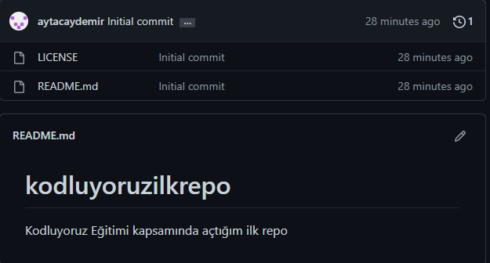

# Kodluyoruz Ilk Repo

Bu repo [Kodluyoruz](https://www.kodluyoruz.org/) Front-End Eğitiminde oluşturduğumuz ilk repo. İçerisinde bir adet README dosyası, bir adet de index.html dosyası barındırıyor. 

# Installation

Öncelikle projeyi clonelayın. 

```https://github.com/aytacaydemir/kodluyoruzilkrepo.git```


# Usage 

Projeyi cloneladıktan sonra Visual Studio Code programında açınız. 

```Linux için: cd kodluyoruzilkrepo ```
```code .```

# Contributing

Pull requestler kabul edilir. Büyük değişiklikler için, önce neyi değiştirmek istediğinizi tartışmak için bir konu açınız. 

# License 

MIT



 
# Patika Link

[Patika Adresim için tıklayınız!](https://app.patika.dev/aytac/)